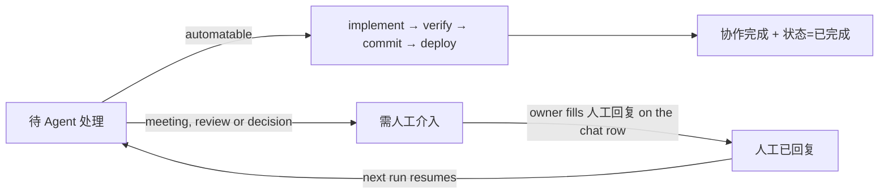

# Culvoy Agent Guide

This is the canonical operating guide for `E:/workspace/LingTour`. Read it before inspecting, editing, testing, cleaning, committing, pushing, migrating, or deploying. Read [`docs/CURRENT-STATE.md`](docs/CURRENT-STATE.md) for the live Git, production, verification, WIP, and backlog state; documents under [`docs/archive/`](docs/archive/) are historical evidence, not current status.

Companion guides: [`docs/development.md`](docs/development.md) covers environment setup, branches, code standards, commit conventions, and collaboration; [`docs/release.md`](docs/release.md) covers the release process, server configuration, migrations, and smoke tests. Long-standing documents (this guide, `CURRENT-STATE.md`, `PRODUCT.md`, `DESIGN.md`) are English; newer team-facing guides are Chinese. Both languages are authoritative for their own topics.

## 1. Product and repositories

Culvoy is a full-stack Guangdong cultural-travel product for international travellers: city culture, story routes, interpreting and bookings, shop and PayPal payments, community, accounts, and a real operations/CMS admin.

| Path | Application | Stack |
| --- | --- | --- |
| `site/` | Public site | Next.js 16, React 19, Tailwind CSS 4, GSAP |
| `api/` | API | NestJS 11, TypeORM, PostgreSQL, JWT, PayPal |
| `admin-frontend/` | Admin | Vue 3, Vite, Element Plus, GSAP |

The public site is brand-first: an evolved Field Journal / Living Field Atlas—editorial, tactile, cinematic, calm, and culturally specific. The admin is a focused workflow product; design serves operational clarity.

## 2. Environment addresses

Keep local and production addresses strictly separate. Never point local work at production write endpoints.

| Environment | Public site | Admin | API |
| --- | --- | --- | --- |
| Local development | `http://localhost:3000` | `http://localhost:5173` | `http://localhost:8000` |
| Production | `https://culvoy.com` | `https://admin.culvoy.com` | `https://api.culvoy.com` |

- API health: production `https://api.culvoy.com/health`; local `http://localhost:8000/health`.
- Production topology: host Nginx (TLS, BT panel) → `127.0.0.1:8088` → the `lingtour-nginx` Docker gateway, which routes by Host to the `site`/`api`/`admin` containers. Deployment runs `tools/deploy-docker.sh` through the `Deploy LingTour Docker Stack` GitHub Actions workflow, which is `workflow_dispatch`-only (pushes to `main` trigger CI only, never a deploy). PM2 processes on the server are retired and kept stopped. See [`docs/release.md`](docs/release.md) for deployment channels and rollback.
- Domain migration (2026-09): `culvoy.com` / `admin.culvoy.com` / `api.culvoy.com` are the production domains. The legacy `lingfengtranstour.cn` family is kept in parallel (server_name and smoke checks) during the transition and must not be removed until the migration is closed.

## 3. Mandatory startup

Before editing, inspect both repositories:

```bash
git -C E:/workspace/LingTour status --short --branch
git -C E:/workspace/LingTour log -12 --oneline --decorate
git -C E:/workspace/LingTour/admin-frontend status --short --branch
git -C E:/workspace/LingTour/admin-frontend log -12 --oneline --decorate
```

Then read, in order:

1. `E:/workspace/LingTour/PRODUCT.md`
2. `E:/workspace/LingTour/DESIGN.md`
3. `E:/workspace/LingTour/docs/UI-OVERHAUL-2026.md`
4. `E:/workspace/LingTour/docs/RESPONSIVE-SPEC.md`
5. `E:/workspace/LingTour/AGENT.md`
6. `E:/workspace/LingTour/docs/CURRENT-STATE.md`
7. Dated files under `E:/workspace/LingTour/docs/archive/` (handoffs, progress records) only when historical context is needed

Archived documents are historical context. Recheck every SHA, status claim, completed item, and deployment claim against live Git/code/production before relying on it.

When touching the site, also read:

- `E:/workspace/LingTour/site/CLAUDE.md`
- `E:/workspace/LingTour/site/AGENTS.md`
- Relevant guides under `E:/workspace/LingTour/site/node_modules/next/dist/docs/`; this Next.js version has breaking changes.

Read the relevant `package.json`, current implementation, API DTO/entity, and migration before changing a contract. Current code, schema, package scripts, and live Git state override old design or deployment notes.

## 4. Double-repository workflow

`E:/workspace/LingTour/admin-frontend` is an independent Git repository, while the root repository also tracks its files as ordinary files; it is not a submodule.

For every admin change:

1. Protect existing changes in both repositories.
2. Check status and diff from both repository roots.
3. Validate the admin build and real browser flow.
4. If commits were requested, commit the precise files in the admin repository first.
5. Commit the matching `admin-frontend/...` files in the root repository.
6. Keep the changes logically and byte-wise equivalent and report both SHAs.

The only known intentional tracked-tree difference is `admin-frontend/.vscode/extensions.json`, tracked by the independent admin repository but ignored by the root repository.

Never use broad staging. Use exact paths:

```bash
git -C E:/workspace/LingTour/admin-frontend add -- src/path/a src/path/b
git -C E:/workspace/LingTour add -- admin-frontend/src/path/a admin-frontend/src/path/b
```

Do not commit, push, deploy, migrate, or mutate production data unless requested or durably authorized. Deployment to production happens only through the `workflow_dispatch` deploy workflow or by running `tools/deploy-docker.sh` on the server.

## 5. Protect the workspace

Never run or use:

- `git reset --hard`
- `git checkout -- <path>`
- broad `git restore`
- `git clean -fd`, `git clean -fdX`, `git clean -fdx`, or variants with a second `-f`
- `git stash` without explicit approval
- `git add -A`, `git add .`, or broad staging
- broad formatting, auto-fix, generated-file rewrites, or deletion based only on ignored status
- deletion/replacement of changes whose ownership is unclear
- edits inside unrelated `.claude/worktrees`
- secrets, private keys, tokens, database credentials, or `.env` values in commits, logs, prompts, or documentation

A root Git clean can delete untracked business source, local config, uploads, assistant state, and files tracked only by the nested admin repository. Cleanup must use an explicit reviewed path manifest.

Before destructive cleanup:

1. Record status from both repositories and all registered worktrees.
2. Protect current WIP and untracked source with an external recovery copy.
3. Distinguish generated test results from tracked regression tests.
4. Delete only named paths after checking Git ownership, references, symlinks/junctions, and active processes.
5. Recheck both repository statuses after every cleanup group.

Preserve formal tests. Never delete a failing test to make a task green. `npm run lint` in `api/package.json` uses `--fix`, and `npm run format` writes files; neither is a read-only validation command.

Use `admin-frontend/.env.local`, not an unignored plain `.env`, for local admin configuration. Respect root and package-level `.gitignore` files, but ignored does not mean disposable: `api/uploads`, local env/config, tool configuration, and worktrees are examples.

## 6. Data, API, and content rules

- Use the real API and production-shaped data; do not introduce fake, placeholder, screenshot-only, or local-only business data.
- Local site/admin visual work normally reads from `https://api.culvoy.com`; explain impact and obtain authorization before writing production data.
- Site variables: `NEXT_PUBLIC_API_URL=/api/v1` (same-origin relative path — production compose sets this, and browser calls ride the nginx same-origin proxy so the `culvoy_session` cookie is carried automatically) and `INTERNAL_API_ORIGIN=https://api.culvoy.com/api/v1`. `server-api.ts` uses `INTERNAL_API_ORIGIN` verbatim as the API base URL, so the value must include the `/api/v1` path (production compose sets `http://api:8000/api/v1`). Do not change `NEXT_PUBLIC_API_URL` to an absolute cross-origin URL: browser-side traveler calls (`PATCH /auth/me`, avatar, favorites) send `credentials: "same-origin"` and would silently lose the session cookie and start failing with 401.
- Admin variables: `VITE_API_ORIGIN`, `VITE_SITE_ORIGIN` or `VITE_SITE_PREVIEW_ORIGIN`, and `VITE_MEDIA_ORIGIN`.
- The admin client calls `/api/admin`; Vite/Nginx rewrite it to `/api/v1/admin`. Preserve this proxy contract.
- Start the local API only for API work; do not start or reset it merely to obtain data for UI work.
- Admin labels, field names, help, and operational messages are Chinese. Business body content is authored once in English and displayed verbatim by the public site.
- Content is English-only: the deployed migration `1762300000000-EnglishOnlyContent` collapsed the legacy `{ en, zh }` JSONB values into the single-English contract, and the admin edits a single English value. Do not reintroduce `zh` content fields.
- Admin save success is insufficient: verify the request, persistence after refresh/re-login, audit/state transitions, and resulting public output.
- Admin previews must use the real public page/preview route, including unsaved draft transfer. Never build an approximate fake preview in the admin.
- Preserve routes, slugs, auth flows, SEO entry points, public API paths, image-only records, and compatibility fields unless an explicit migration changes them.
- Mixed image/video changes must preserve existing image records; videos require validated type, poster fallback, controls, and public playback verification.

Never run:

- `npm run seed:reset`
- any seed/import/sync command containing `--apply` without explicit confirmation of target and backup
- a TypeORM migration against any database until the target, backup, existing migration state, and migration plan are confirmed
- destructive E2E against production without explicit approval and cleanup/recovery design

Never rewrite an already-executed migration; add a new migration. `api/src/database/data-source.ts` has `synchronize: false`; keep it that way.

## 7. Mandatory UI and design process

For public-site visual, layout, interaction, or motion work, invoke/read before implementation:

- `taste-skill`
- `gsap-core`
- `gsap-react`
- `gsap-scrolltrigger`
- `gsap-performance`
- `fixing-accessibility`
- `fixing-motion-performance`

Use `agent-browser`, `playwright`, or `webapp-testing` for browser validation. Impeccable is an auxiliary audit tool, not a replacement for Taste, accessibility, GSAP, or real browser testing.

Process:

1. State the design read and preserve the product language.
2. Use current CSS/tokens and real production content as the baseline.
3. Fix hierarchy, spacing, grids, states, and component-responsive behavior first.
4. Add GSAP only where motion explains hierarchy, direction, state, or narrative.
5. Review accessibility, cleanup, reduced motion, and low-end/mobile performance.

Design dials:

- Public site: `DESIGN_VARIANCE=7`, `MOTION_INTENSITY=7`, `VISUAL_DENSITY=4`
- Admin: `DESIGN_VARIANCE=4`, `MOTION_INTENSITY=4`, `VISUAL_DENSITY=6`

Public pages must not become generic SaaS grids, glass cards, gradient text, excessive pills, repetitive tape/rotation/grain, or simple desktop stacks. Admin changes preserve Element Plus and prioritize workflow clarity. All text stays horizontal; decorative small-angle rotations that belong to the Field Journal language are acceptable, vertical text is not.

Use `useGSAP()` with a scoped root in React. In Vue use `gsap.context()` and `ctx.revert()`. Use `gsap.matchMedia()` for responsive variants, animate transforms/opacity rather than layout, and clean up every tween and ScrollTrigger. Reduced-motion users must receive immediately visible content with no pin/scrub or decorative continuous motion.

## 8. Development and validation commands

Local development runs **only through Docker Compose** (hard decision, 2026-09-18). Do not start host-side `npm run dev` / `npm run start:dev` processes: they occupy ports 3000/5173/8000 and kill the containers mapped to the same ports (the 2026-09-18 admin container `Exited(137)` was exactly this). Containers run build artifacts, not hot-reload dev servers — rebuild the touched tier after code changes, and note that `--build` bakes the current working tree (including uncommitted files) into the image.

```bash
cd E:/workspace/LingTour
docker compose up -d              # site http://localhost:3000 / admin http://localhost:5173 / api http://localhost:8000
docker compose up -d --build api  # rebuild one tier after code changes (same for site / admin)
docker compose ps                 # three containers healthy
docker compose logs -f api        # inspect one service
```

Default URLs are site `http://localhost:3000`, admin `http://localhost:5173`, and API `http://localhost:8000`. The api container reuses the host PostgreSQL via `host.docker.internal:5432` (credentials from `api/.env`, compose only overrides `DB_HOST`), and uploads bind-mount to `api/uploads`, so data and migration state survive rebuilds. Admin's API/media origins come from compose build args (`http://api:8000` proxy, `http://localhost:8000` for browser media); the host-side `admin-frontend/.env.local` only affects a manually started Vite dev server, never the container.

Validate every touched application. Do not repair unrelated pre-existing failures silently.

Site:

```bash
cd E:/workspace/LingTour/site
npx tsc --noEmit --skipLibCheck
npm run lint
npm run test:ci
npm run build
```

Admin:

```bash
cd E:/workspace/LingTour/admin-frontend
npm run build
```

API:

```bash
cd E:/workspace/LingTour/api
npx tsc --noEmit --skipLibCheck
npm test -- --runInBand
npm run build
```

Repository checks:

```bash
git -C E:/workspace/LingTour diff --check
git -C E:/workspace/LingTour diff -- <task-files>
git -C E:/workspace/LingTour/admin-frontend diff --check
git -C E:/workspace/LingTour/admin-frontend diff -- <task-files>
```

The root package has no build/test scripts; run commands in the three application directories. The site has no `npm run type-check`; use the explicit TypeScript command above.

## 9. Browser verification

Builds and screenshots alone are insufficient. Use a real browser and exercise changed flows, requests, console, loading, error, empty, success, refresh, and back/forward behavior.

For responsive UI, test relevant pages at `320, 375, 390, 430, 768, 834, 1280, 1440, 1920` CSS pixels.

Check:

- no page-level horizontal overflow, overlap, clipped actions, or crushed text
- 44px touch targets and at least 16px mobile form controls
- keyboard navigation, visible focus, dialog focus containment/restoration, Escape behavior, and background shortcut isolation
- reduced motion and hidden/background-tab resilience
- real navigation, filters, carousels, forms, login, dialogs, preview, save, and refresh
- broken images/video, poster fallback, controls, slow loading, and network/API errors
- GSAP cleanup after route/component teardown

`tools/mobile-verify.mjs` and `tools/mobile-perf.mjs` are supplemental only. They cover a subset of viewports, may require undeclared Puppeteer, and write temporary reports/screenshots that must not be committed.

## 10. Deployment and migrations

Full details—release channels, Docker topology, environment variables, rollback—live in [`docs/release.md`](docs/release.md). Non-negotiable rules:

1. Verify tests/builds and both repository statuses.
2. Review every migration; add rather than rewrite migrations.
3. Back up the target database and run a read-only migration status check.
4. Push the independent admin repository and root repository only with authorization.
5. Inspect any GitHub Actions deployment triggered by root `main`.

Approved deployment is the standard channel—the `Deploy LingTour Docker Stack` workflow (`workflow_dispatch`-only), which SSHes to the server and runs the authoritative script:

```bash
gh workflow run deploy.yml --ref main
gh run watch   # monitor the run to completion
```

Or, after explicit authorization, run the same authoritative script directly on the server:

```bash
ssh Ravi-server "cd /root/LingTour && bash tools/deploy-docker.sh"
```

`tools/deploy-docker.sh` is the Docker deployment source of truth. It backs up the server Git state, fast-forwards to `origin/main`, builds the site/api/admin images, runs pending TypeORM migrations (`migration:run`), restarts the containers and the nginx gateway, and performs health checks. Its Git backup is not a database backup—rule 3's database backup is a separate host-level `pg_dump -Fc`. Never place unpushed source only on the server.

Post-deploy:

```bash
ssh Ravi-server "cd /root/LingTour && git rev-parse --short HEAD && docker compose -f docker-compose.prod.yml ps"
```

Then verify production API health, Home, changed pages, representative Culture/Route details, Interpreting/booking, Shop/Checkout, Login/Profile, Community, and changed admin create/edit/save/preview/status flows.

## 11. Definition of done

A development task is done only when:

- unrelated work is preserved and the diff contains only the task
- required skills and design process were followed
- relevant type checks, tests, builds, and `git diff --check` pass
- required browser widths and real interactions pass
- accessibility, reduced motion, loading/error/empty states, and media fallbacks pass
- data changes use the real API, survive refresh/re-login, and produce the expected public result
- admin changes remain synchronized in both repositories
- exact validation results and pre-existing failures are recorded

If commit/release was explicitly requested, done additionally requires one logical change per precise commit, correct remotes, synchronized admin/root commits, approved database backup/migration/deployment, production smoke tests, and reporting both repository SHAs plus the deployed root SHA. Otherwise report commit, push, migration, and deployment as pending; never perform them automatically.

## 12. Current work pointer

Read `docs/CURRENT-STATE.md` before every task. It contains the dated live state, protected WIP, unpushed changes, verification evidence, deployment queue, and backlog. Update it whenever responsibility, Git state, production state, or cleanup/recovery state materially changes.

## 13. Feishu task Base (project tracker)

Delivery tracking for this workspace lives in a Feishu Base, not in this repository. It is an external system: reads are free, and writes happen only on a direct owner request or inside the standing authorization the owner granted to the **unattended scheduled runner** on 2026-09-19 (§13.6) — never as an unprompted side effect of an ordinary code task, and never inherited by an interactive session that was not given the same authorization. The owner remodeled the collaboration model twice on 2026-09-19: first a third table (协作对话) plus four new 待办事项 fields; then, later the same day, a second pass that **deleted 待办事项·人工意见 and 协作对话·父记录**, **added two read-only lookup fields**, **added 协作对话·人工回复 (text) as the owner's new input slot**, and **added a two-condition-filtered 待我回复 view**. The spec below was re-verified read-only against the live Base after that second pass with `lark-cli` 1.0.65 and a `ready` user token (`lark-cli whoami`); re-check it when a write fails unexpectedly rather than trusting it forever.

| Item | Value |
| --- | --- |
| Base | 项目待办管理 |
| `base_token` | `PWLpbO2Y0aqDrhsdcjicBoDIn9m` |
| URL | `https://mcnolxrqwlqo.feishu.cn/base/PWLpbO2Y0aqDrhsdcjicBoDIn9m` |
| Timezone | Asia/Shanghai |

Tables: `项目` `tblVHHfoMJBfQFQ5` (项目名称 text primary `fld3FRavHI`, 项目状态 select 未开始/进行中/已暂停/已完成/已取消 `fld7Pgli8z`, 项目描述 text `fldNhBjSjV`, 开始日期 `fldlqtjkrL` and 截止日期 `fldy2SIlMV` datetime, 相关待办 link reverse `fldO73rOZf` — 2 records on 2026-09-19: Culvoy 进行中, Autoflow 未开始); `待办事项` `tbl21w4yWuCJ9wEs` (11 fields, §13.1); `协作对话` `tblyVHclbUfXIy33` (8 fields, §13.2). Live record counts on 2026-09-19 after the second remodel: 待办事项 8 (3 协作完成/已完成, 5 需人工介入/待处理), 协作对话 8 (3 状态变更, 5 提问). That snapshot aged within the same day — by the evening of 2026-09-19 the live Base held 待办事项 17 (5 协作完成, 4 需人工介入, 7 待 Agent 处理, 1 人工已回复) and 协作对话 36 (14 状态变更, 14 提问, 8 审核结论). The tracker is in real use, so a populated table is normal and **every count in this section is a timestamp, not a spec** — re-read it. An empty table is still a valid state, not a broken read.

### 13.1 待办事项 fields and views

| Field | Field ID | Type | Accepted cell values |
| --- | --- | --- | --- |
| 待办事项 | `fldi80oJpo` | text | primary field |
| 所属项目 | `fldVG5QM2o` | link → `tblVHHfoMJBfQFQ5` | `[{"id":"rec_xxx"}]`; bidirectional, reverse field 相关待办 `fldO73rOZf` |
| 状态 | `fldQEHZYKR` | single select | 待处理 / 进行中 / 已完成 / 已取消 |
| 优先级 | `fldzo0XOpN` | single select | P0 紧急 / P1 高 / P2 中 / P3 低 |
| 截止日期 | `fldfS8O5x1` | datetime | `"YYYY-MM-DD HH:mm:ss"`; displayed as yyyy/MM/dd |
| 负责人 | `fldQVsLlum` | user | `[{"id":"ou_xxx"}]`; resolve the open_id first; all null on 2026-09-19 |
| 备注 | `fldqllCLK7` | text | - |
| 协作状态 | `fldIxIGjyY` | single select | 待 Agent 处理 / 需人工介入 / 人工已回复 / 协作完成 |
| 人工回复 | `flddDWY5eY` | lookup ← `协作对话` | **read-only derived field** — field definition re-read 2026-09-19: `select: "人工回复"`, i.e. it projects the linked chat row's 人工回复 `fldg34yYVW`, **not** 对话内容 (an earlier version of this section claimed 对话内容; that was wrong and misled a review). Consequence: this column is empty for every thread the owner has not answered yet, and non-empty exactly where the owner filled the chat row's reply slot. The agent must never write it; the API rejects/ignores writes to lookups. |
| 最新对话 | `fldV2iNREZ` | text | one-line summary of the latest message in the thread |
| 对话记录 | `fldd0jcMKH` | link → `tblyVHclbUfXIy33` | `[{"id":"rec_xxx"}]`; bidirectional, reverse field 所属待办 `fldQ5MGCcI` |

Views: 表格 `vewiODnqdM` (grid, default), 按状态看板 `vewNQtFWZe` (kanban, grouped by 状态 `fldQEHZYKR`), 待我处理 `vewlMV8QYB` (grid, filter 协作状态 == 需人工介入 — the owner's inbox), 协作看板 `vewn1NMlVj` (kanban, grouped by 协作状态 `fldIxIGjyY`).

### 13.2 协作对话 fields and views

| Field | Field ID | Type | Accepted cell values |
| --- | --- | --- | --- |
| 消息类型 | `fldbsnbxVC` | single select | 提问 / 回复 / 审核结论 / 状态变更 |
| 说话方 | `fldyiLN5e9` | single select | Agent / 人工（Ravi） / 系统 — note the full-width parentheses |
| 轮次 | `fldm3jKJ8u` | number | integer, incremented once per message |
| 时间 | `fldis4336u` | datetime | `"YYYY-MM-DD HH:mm:ss"`; displayed as yyyy/MM/dd HH:mm |
| 对话内容 | `fldJdKGttg` | text | - |
| 所属待办 | `fldQ5MGCcI` | link → `tbl21w4yWuCJ9wEs` | `[{"id":"rec_xxx"}]`; bidirectional, reverse field 对话记录 `fldd0jcMKH` |
| 协作状态 | `fld0tEDzpN` | lookup ← `待办事项` | **read-only derived field** (aggregate `raw_value` over the todo linked via 所属待办, projecting its 协作状态). Never write it; it mirrors the todo row. |
| 人工回复 | `fldg34yYVW` | text | **the owner's input slot** — the agent must never write it, and must never rewrite a 协作对话 row whose 说话方 is 人工（Ravi）. This is where 需人工介入 → 人工已回复 actually happens now; the deleted 待办事项·人工意见 is gone. |

The former 父记录 self-link `fldo0hpmG4` was **deleted** in the second remodel — threads are flat; order replies by 轮次 and 时间.

No standalone text title field: every 协作对话 row must carry 消息类型 and 对话内容, or it renders blank in the Feishu UI. 说话方 defaults to 人工（Ravi） and 消息类型 defaults to 回复 in the create form, so an agent row must set both explicitly or it will look like an owner reply.

Views: 全部对话 `vewd7Ut6Bg` (grid), 按待办分组 `vew6ysjcrX` (grid, grouped by 所属待办 `fldQ5MGCcI`), 待我回复 `vewFFwi711` (grid, filter: 协作状态 `fld0tEDzpN` == 需人工介入 **AND** 人工回复 `fldg34yYVW` empty — the owner's reply inbox).

### 13.3 Collaboration state machine

The 待办事项 table carries two status fields with different authority—keep them consistent and never leave a contradictory pair. 协作状态 `fldIxIGjyY` is the agent's field (who acts next); 状态 `fldQEHZYKR` is the business field (whether the task as a whole is done).



- Agent transitions: 待 Agent 处理 → 协作完成 on real completion, or → 需人工介入 when it must hand back. **Picking up:** when the agent detects a non-empty 人工回复 `fldg34yYVW` on a thread, it first sets that todo's 协作状态 back to 待 Agent 处理 (its 已接手 signal), then works. 人工已回复 is the owner's optional marker only — the agent never requires it to proceed, so no round can deadlock waiting for it.
- The owner answers in **协作对话·人工回复 `fldg34yYVW`** (not the deleted 待办事项·人工意见). That row then leaves the 待我回复 view.
- **Known gap — discover answers on the thread, not the todo row.** 待我处理 `vewlMV8QYB` filters only on 协作状态 == 需人工介入, so once the owner answers on the chat row the todo row *keeps sitting in that inbox* until someone moves its 协作状态 off 需人工介入. An unattended agent must therefore find pending answers by **scanning 协作对话 for rows where 人工回复 `fldg34yYVW` is non-empty** (the 待我回复 view minus the rows already answered), and then itself reset that todo's 协作状态. Do not rely on the todo's 协作状态 alone.
- Handing back: append a 协作对话 row (消息类型=提问, 说话方=Agent, 轮次=max+1, 时间, 对话内容) and set the todo's 协作状态=需人工介入 + 最新对话; leave 人工回复 empty — that is the owner's slot.
- Completing: only when the work was really implemented, verified, committed and deployed. Append a 协作对话 row (消息类型=状态变更 or 审核结论) and set 协作状态=协作完成 together with 状态=已完成.
- Writing a 协作对话 row's 所属待办 is enough — the reverse 对话记录 link on the todo row fills itself; do not write both sides. An empty 待办事项 table is a valid state: exit gracefully, do not error.
- 轮次 is not auto-incremented: read the thread's current max 轮次 for that todo and write max+1 (all 8 live rows are still 轮次=1).
- **Per-round work cap: at most 3 待办事项 records per run.** When more than three todos are actionable (协作状态 == 待 Agent 处理, or a thread carrying a non-empty 人工回复), take the highest-priority three and carry only those to completion or hand-back; leave the rest untouched for later runs and state in the reply which todos were deferred. Read-only inspection of the table and the current-state refresh are not counted against the cap — only todos the agent actually acts on are. If all actionable todos are smaller than the cap, do not pad the round.

### 13.4 Command templates

```bash
BT=PWLpbO2Y0aqDrhsdcjicBoDIn9m      # base_token
T_PROJ=tblVHHfoMJBfQFQ5             # 项目
T_TODO=tbl21w4yWuCJ9wEs             # 待办事项
T_CHAT=tblyVHclbUfXIy33             # 协作对话
```

Read (risk: read):

```bash
lark-cli base +table-list  --as user --base-token "$BT"
lark-cli base +field-list  --as user --base-token "$BT" --table-id "$T_TODO"
lark-cli base +view-list   --as user --base-token "$BT" --table-id "$T_TODO"
lark-cli base +view-get-filter --as user --base-token "$BT" --table-id "$T_TODO" --view-id "vewlMV8QYB"
lark-cli base +view-get-filter --as user --base-token "$BT" --table-id "$T_CHAT" --view-id "vewFFwi711"
lark-cli base +record-list --as user --base-token "$BT" --table-id "$T_TODO"
lark-cli base +record-list --as user --base-token "$BT" --table-id "$T_CHAT"
lark-cli base +data-query  --as user --base-token "$BT" --table-id "$T_TODO"   # filters, aggregation
```

Create a 待办事项 (risk: write):

```bash
lark-cli base +record-batch-create --as user --base-token "$BT" --table-id "$T_TODO" \
  --json '{"fields":["待办事项","所属项目","状态","协作状态","优先级","截止日期","备注"],"rows":[
    ["新待办示例",[{"id":"rec_xxx"}],"待处理","待 Agent 处理","P2 中","2026-10-10 00:00:00",null]]}'
```

Append a 协作对话 message (risk: write) — writing 所属待办 fills the todo row's reverse 对话记录 link automatically:

```bash
lark-cli base +record-batch-create --as user --base-token "$BT" --table-id "$T_CHAT" \
  --json '{"fields":["消息类型","说话方","轮次","时间","对话内容","所属待办"],"rows":[
    ["提问","Agent",1,"2026-09-20 09:35:00","<question text>",[{"id":"rec_todo"}]]]}'
```

Update (risk: write) — one identical patch is applied to every listed record:

```bash
lark-cli base +record-batch-update --as user --base-token "$BT" --table-id "$T_TODO" \
  --json '{"record_id_list":["rec_xxx"],"patch":{"协作状态":"需人工介入","最新对话":"<summary>"}}'
```

Delete (risk: high-risk-write, `--yes` only after the owner confirms the exact target):

```bash
lark-cli base +record-delete --as user --base-token "$BT" --table-id "$T_TODO" \
  --record-id "rec_xxx" --record-id "rec_yyy" --yes
```

Kanban grouping:

```bash
lark-cli base +view-set-group --as user --base-token "$BT" --table-id "$T_TODO" \
  --view-id "vewn1NMlVj" --json '{"group_config":[{"field":"协作状态","desc":false}]}'
```

### 13.5 Rules and known pitfalls

- Cell values: link → `[{"id":"rec_xxx"}]`; single select → the exact option label; datetime → `"YYYY-MM-DD HH:mm:ss"`; user → `[{"id":"ou_xxx"}]`. Never guess user, chat, or linked-record IDs—resolve them with `+record-list` / `+record-search` first. Full shape reference: `lark-cli skills read lark-base references/lark-base-cell-value.md`.
- Option labels are matched verbatim, including 人工（Ravi） 's full-width parentheses. A near-miss silently creates nothing or drops the value.
- 协作对话·人工回复 `fldg34yYVW` is the owner's input slot (待办事项·人工意见 `fldKDY7jJm` was deleted in the second remodel). The agent must never write it, and must never rewrite a 协作对话 row whose 说话方 is 人工（Ravi）.
- Two lookup fields are **derived and read-only** — 待办事项·人工回复 `flddDWY5eY` (projects the linked chat row's 人工回复 `fldg34yYVW`, i.e. the owner's own answer; **empty until the owner answers**, which is why an agent-recorded decision never shows up there) and 协作对话·协作状态 `fld0tEDzpN` (mirrors the todo's 协作状态). Never include them in a write patch.
- A decision the owner gives **in a local session** (not in the Base) is invisible in 待办事项·人工回复 by construction. Record it as a 协作对话 row with 消息类型=审核结论 and 说话方=Agent, stating explicitly that the source is the local session — never write it into 人工回复 `fldg34yYVW`, which belongs to the owner alone.
- Two different fields share the name 人工回复: the 待办事项 one `flddDWY5eY` is a read-only lookup, the 协作对话 one `fldg34yYVW` is the owner's editable text slot. Match on the field ID, not the name.
- **Concurrent runs are real.** A scheduled/unattended agent can write this same Base while a manual session is editing it — observed 2026-09-19 (a manual pass saw 协作状态 counts and the 协作对话 record count change mid-inspection: 26→32 rows while it wrote 7 of them). Read `rev` on every pull, verify your own writes **by record_id**, never by total row count, and never assume a row that moved was moved by you. If a todo you are about to act on already carries an unanswered 提问 from another run, do not duplicate it.
- Both sides of a bidirectional link must not be written separately — write 所属待办 on the 协作对话 row and let 对话记录 fill itself.
- Risk levels are printed in every command's `--help`: read is free; write (`+record-batch-create`, `+record-batch-update`, `+view-set-group`) only on owner request; high-risk-write (`+record-delete`, permission changes) needs `--yes` plus explicit owner confirmation of the target.
- `+record-delete` takes repeated `--record-id` flags, one per record; a JSON array does not work.
- Never judge success from a pipeline exit code (`| jq`, `| head`). Read `"ok": true` from the CLI's own output, or redirect to a file and read that. A pipeline-filtered false negative once caused a retry and duplicate records.
- `+record-batch-update` cannot write per-row values; issue one call per distinct value.
- Batch limits: 200 rows per create, 200 records per update.
- The CLI reports 1.0.96 available against the installed 1.0.65. Confirm the flags are unchanged before running `lark-cli update`.
- The owner's OAuth token needs re-login roughly around 2026-09-25. `lark-cli whoami` reports `tokenStatus`; when it is not `ready`, re-authorize before writing instead of retrying blindly.
- The 待办事项 table held 17 records and 协作对话 36 as of the evening of 2026-09-19 (5 协作完成 / 4 需人工介入 / 7 待 Agent 处理 / 1 人工已回复); a populated table is normal, and an empty one must still read as normal rather than as a failed read. Treat any count in this section as a timestamp — concurrent runs move it within the hour.
- `tools/deploy-docker.sh` — the authoritative deploy path — backs up **only** the server Git state, to `/root/backups/lingtour-docker-predeploy-<timestamp>` (status, unstaged and staged diffs), then runs `git reset --hard HEAD` on the server checkout. It performs **no database backup** and does not prompt. Two consequences that bear directly on authority: (a) it runs `npx typeorm migration:run` on every deploy, so **authorizing a deploy authorizes a schema migration**; (b) "the deploy is reversible" is true for code (redeploy the previous commit) and false for data — an applied migration or a production CMS write is not recoverable from that Git backup.
- Source notes for this section: `docs/lark-base-handoff.md` (an earlier handoff that predates both 2026-09-19 remodels; its record-level sample data is illustrative and stale—the spec above was re-verified against the live Base after the second remodel).

### 13.6 Standing authorization for the unattended runner (2026-09-19)

The owner widened the unattended scheduled runner's authority on 2026-09-19: it is no longer expected to stop at a local change and wait for a human to ship it. **This section authorizes the scheduled/unattended runner only.** An interactive session, or any other agent, does not inherit it and keeps asking per the §13 preamble.

Granted — the runner may do these without asking on each run:

| Area | Granted |
| --- | --- |
| Local | edit code/docs, run type checks, tests, builds, real-browser verification |
| Git | commit on exact paths, push `origin/main` in both repositories, revert its own bad commit |
| Deploy | `gh workflow run deploy.yml --ref main`, `gh run watch`, production health check and page verification |
| Feishu | write 待办事项 协作状态 / 状态 / 最新对话 / 备注; append 协作对话 rows; read anything |
| Production content | publish real business content through the admin API (e.g. the rewritten city/route/product copy) when the linked todo authorizes it |

**The one red line: deletion.** Forbidden without an explicit, per-instance owner confirmation. It covers literal deletes *and* destructive overwrites that leave no way back:

- files/directories: `rm`, `git rm`, `git clean -fd*`, anything under `api/uploads`
- Git history: `git reset --hard`, `git checkout -- <path>`, broad restore, stash drop, force push, amend/rebase of an already-pushed commit, branch or tag deletion
- Feishu schema and records: `+record-delete`, deleting or renaming fields, deleting views
- Database: `DROP` / `TRUNCATE` / `DELETE` in a migration or ad-hoc SQL, `npm run seed:reset`, any import/sync containing `--apply`, destructive E2E against production
- production CMS records deleted, or existing content replaced wholesale with no recorded prior value

**Explicitly allowed, and not "deletion"** — otherwise no code could ever change: deleting or rewriting lines inside a tracked source file, overwriting tracked files (Git is the recovery path), updating existing Feishu field values, and correcting content that was itself wrong as long as the prior value is preserved in the thread.

**Three guards the widening does not remove** — they are what makes "recoverable is enough" actually true rather than merely assumed:

1. **Back up before the irreversible.** Before any run that (a) applies a pending migration or (b) writes production business content, take a timestamped `pg_dump -Fc`, verify the file is non-empty, and record its path in the Feishu thread. The deploy script's own backup covers Git only (§13.5).
2. **Migration gate.** Because `deploy-docker.sh` runs `migration:run` automatically, granting deploy grants migrations. Additive-only migrations (new table, new nullable column) may ride the deploy. Any migration containing `DROP` / `TRUNCATE` / `DELETE` or a destructive column-type change stops the run: back up, then hand back as 需人工介入 instead of applying it.
3. **Deploy mutual exclusion.** Concurrent runs are real (§13.5), and two authorized runners pushing and deploying at once corrupt each other. Before push: `git fetch` and confirm the branch is still even with `origin/main`; abort and re-read on divergence. Before deploy: check for an in-flight deploy workflow run and skip if one exists. Never re-run a failed deploy automatically.

The per-run cap still applies — at most 3 待办事项 per run. Widened authority is not widened blast radius.
