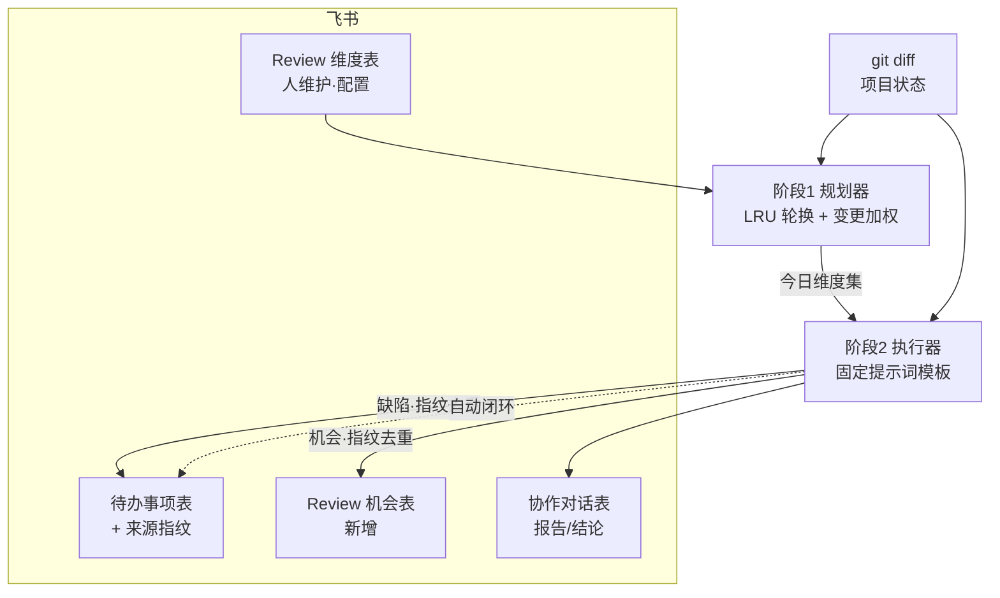

# 定时多维 Review 系统 · 设计文档

> 状态：**部分落地**（2026-09-19 起草，同日落地飞书表结构与 NewMax 定时任务）。**约束性规范以 [`../AGENT.md`](../AGENT.md) §13.7 为准**，本文件是设计依据与取舍记录，冲突时以 AGENT.md 为权威。

本文件定义一套「每天自动做一轮多维 review，并把结论写回飞书」的系统。它的授权边界、飞书表规范、写入风险等级**全部复用** [`../AGENT.md`](../AGENT.md) §13，本文件不重复定义，只补充 review 特有的设计。

---

## 1. 目标与非目标

**目标**

- 每天自动挑若干审查维度，对项目做一轮 review。
- 结论自动写回飞书：缺陷类进待办表，机会类进机会表，过程与报告进协作对话表。
- 全程无需人工配置：人**不需要**每天写提示词。
- 可复现、可审计：同一份输入应产出同一批结论。

**非目标**

- 不做代码自动修复（修复由人工或后续独立任务决定）。
- 不替代 §13.6 的无人值守 runner，而是**作为它的一个输入源**：review 产出待办，runner 按既有规则处理待办。
- 不做实时监控告警（这是部署/健康检查的职责，见 [`release.md`](release.md)）。

---

## 2. 核心设计原则：三层分离

这是整个设计的地基，也是「每次维度不一样，但提示词一样」的解法。

| 层 | 内容 | 存放位置 | 变化频率 | 谁改 |
| --- | --- | --- | --- | --- |
| **协议层**（提示词模板） | 角色、输出 schema、判定标准、去重规则、写表方式 | 仓库代码 | 几乎不变 | 人，走 git |
| **维度层**（审什么） | 维度名 + 检查要点 | 飞书 Review 维度表 | 偶尔增删 | 人，在界面上 |
| **选择层**（今天选哪些维度） | 今日维度集 | 由任务自动计算 | 每天 | 规划器 |

三条硬规则：

1. **提示词模板固定在仓库里，绝不每天改写。** 每天改写提示词（无论人改还是 LLM 改）都会摧毁可复现性与可审计性——昨天的结论和今天无法比较，因为度量衡变了。
2. **飞书表里存「审什么」，不存「怎么审」。** 表里存维度名和检查要点；角色设定、输出 JSON schema、去重逻辑等属于协议层，不进表。
3. **每天变的是「选哪些维度」，不是「编写维度」。** 维度池是人维护的资产；规划器只做选择。

**人工成本（2026-09-19 决策：飞书表 + 偶尔增补）**

- 维度池**不需要每天维护**。建池是一次性动作。
- 此后只有**输出驱动**的增补：人读 review 报告时发现某类问题不在任何现有维度的 `检查要点` 内，才加一行。预期频率为月级，不是每轮。
- 规划器自行更新 `上次审查` 做 LRU 轮换，**轮换无需人工排期**。
- **明确不做**「系统自动新增维度」通道：提议权若交给机器，池子会漂移、膨胀、失去可复现性，等价于绕回「每天重写提示词」。维度选择是价值判断，**生效权留在人手上**。
- 增补不是单向的：**连续多轮零发现的维度应当停用**（`状态=停用`），否则它会白白占用轮换周期、稀释覆盖率。

---

## 3. 飞书数据结构

全部位于 Base `项目待办管理`（`base_token` 见 §13）。

### 3.1 Review 维度表（已建，配置表）

**已建（2026-09-19）**：`table_id` = `tbl09fwzfA6WHkzk`，网格视图 `vewJdz30NQ`。

| 字段 | Field ID | 类型 | 说明 |
| --- | --- | --- | --- |
| 维度名称 | `fld8HLwLmt` | text（主字段） | 如「支付链路健壮性」 |
| 检查要点 | `fldpK7kAnW` | text | 这个维度到底看什么——给执行器的具体指令，可含子问题清单 |
| 分类 | `fldz040oKl` | single select | 代码缺陷 / 业务完整性 / 架构与优化 / 运维 / 体验 |
| 关注路径 | `fld7ivAZe1` | text | 可选；命中这些路径的 git 变更会让该维度优先（如 `api/src/modules/payment`） |
| 状态 | `fldR9JT9Zd` | single select | 启用 / 停用 |
| 优先级 | `fldpwZpGrh` | single select | P0 紧急 / P1 高 / P2 中 / P3 低 |
| 上次审查 | `fldRCFG7cq` | datetime | 规划器更新；用于 LRU 轮换 |
| 上次结论 | `fldQmEMKtV` | text | 一行摘要；规划器与执行器更新 |

**规划器只更新既有行，绝不每天插入新行**——否则这张表会无限膨胀。「今天审什么」= 表里被标记的行（通过 `上次审查` 与当日计划确定，不新增字段）。

增补与停用的触发条件（人手动执行，见 §2 决策段）：

| 动作 | 触发条件 |
| --- | --- |
| 新增维度 | review 报告暴露出某类问题，现有维度的 `检查要点` 都覆盖不到；或项目新增了一整块业务（新模块、新链路），旧池子不可能覆盖 |
| 停用维度 | 连续多轮零发现，或对应业务已下线；改 `状态=停用` 而非删除 |
| 调整 `检查要点` | 该维度有产出但方向不对——**优先改要点，而不是加新维度**，后者会让池子膨胀 |

**增补的真实代价**：覆盖周期 ≈ 池大小 ÷ 每轮 N。池子从 12 涨到 30、N 仍为 3 时，单个维度由 4 天轮到一次变成 10 天一次。增补必须有节制，或同步上调 N（§10 开放问题 2）。

### 3.2 待办事项表（复用，需加一个字段）

沿用 `tbl21w4yWuCJ9wEs`（字段见 §13.1）。**新增字段已建（2026-09-19）**：

| 字段 | Field ID | 类型 | 说明 |
| --- | --- | --- | --- |
| 来源指纹 | `fldyA8gI70` | text | 去重键，格式见 §5 |

其余写入遵循 §13.1：`协作状态` 与 `状态` 成对维护，禁止写两个只读 lookup 字段。

### 3.3 Review 机会表（已建）

**已建（2026-09-19）**：`table_id` = `tblWaouVm5tyBxSe`，网格视图 `vewzHazqBd`。承载**机会类**结论——「可升级点 / 可补的业务逻辑 / 可优化点」。与缺陷分离，因为它的生命周期不同：可长期挂着、可被驳回，不适用「必须修」的紧迫语义。

| 字段 | Field ID | 类型 | 说明 |
| --- | --- | --- | --- |
| 机会标题 | `fldHSfBhx2` | text（主字段） | |
| 来源维度 | `fldP3XuH8j` | text | 产生它的维度名 |
| 机会说明 | `fld36hpGJv` | text | 现状 + 建议做法 |
| 分类 | `fldomua3cg` | single select | 业务完整性 / 架构优化 / 体验提升 / 运维改进 |
| 价值 | `fldlmi9vyZ` | single select | 高 / 中 / 低 |
| 成本 | `fldzYLGHcb` | single select | 高 / 中 / 低 |
| 状态 | `fldYo1XrGS` | single select | 待评估 / 已采纳 / 已排期 / 已完成 / 已驳回 |
| 来源指纹 | `fldXV0Dfgu` | text | 去重键 |
| 发现日期 | `fld6aFVFgy` | datetime | |
| 关联待办 | `fldc9wvprs` | link → 待办事项（`tbl21w4yWuCJ9wEs`） | 采纳后可转成一条待办 |

价值/成本两轴是机会排序的关键——单靠优先级会在「低成本高价值」和「高成本高价值」之间分不清。

### 3.4 协作对话表（复用，承载报告）

沿用 `tblyVHclbUfXIy33`（字段见 §13.2）。一轮 review 写一条汇总记录：

- `消息类型` = **审核结论**
- `说话方` = **Agent**
- `对话内容` = 本轮 report 正文（今日维度、各维度的发现与证据、与上轮的对比）
- `所属待办` = 若本轮只围绕某一条待办，则链接它；否则留空并在文首注明「本轮为全局 review」

单条发现的细节不写进协作对话表，写进对应的待办/机会行；协作对话只留报告级摘要。

---

## 4. 执行流程

**强约束：两个阶段在同一次定时任务内顺序执行**，不要拆成两个各自独立的 cron。否则阶段 2 可能读到阶段 1 尚未写完的数据，且 §13.5 记录的并发写飞书是真实发生过的。

### 4.1 阶段 1 · 规划器

输入：Review 维度表的 `状态=启用` 行、昨天的 git 变更、项目状态。

选维算法（按序）：

1. 过滤 `状态=启用` 的维度。
2. 按 `上次审查` 升序排序——**LRU 轮换**，最久没审的优先。这一条天然保证长期覆盖全，无需人工排期。
3. **变更加权**：若某维度的 `关注路径` 命中昨天的 `git diff --name-only`，其排序提前。
4. 取前 N 个（N 建议 3–5，与 §13.6 的每轮 3 条 cap 协调，见 §5）。
5. 更新这些行的 `上次审查` = 今天。

输出：今日维度集（传给阶段 2 的内存数据，不落飞书）。

### 4.2 阶段 2 · 执行器

输入：今日维度集 + 固定提示词模板 + 项目输入。

1. **装配输入**：只喂 `git diff`、项目状态摘要（`docs/CURRENT-STATE.md` 的相关段）、飞书待办/机会表的现有指纹清单。**不喂整个仓库**——token 成本会失控且无必要。
2. **调查**：按固定模板对每个维度产出一组发现，每条发现标注是**缺陷**还是**机会**，并给出证据（文件、行、来源）。
3. **指纹去重**（§5）：查现有指纹——命中则更新既有行，未命中则新建。
4. **写回**：
   - 缺陷 → 待办事项表（`协作状态=待 Agent 处理`，`状态=待处理`）
   - 机会 → 机会表（`状态=待评估`）
   - 报告摘要 → 协作对话表（一条 `审核结论`）
5. **自动闭环**（§5）：本轮未再出现、且上轮标记为「尚未修复」的缺陷 → 关闭。

---

## 5. 去重与闭环（系统能否活下去的关键）

### 5.1 去重指纹

不做去重，同一个问题会被每天重复审出，待办表几天内就被刷爆，人不再看表——这是自动 review 最常见的死法。

指纹建议：`sha1(维度名 + 文件路径 + 行号 + 问题签名)`，问题签名取归一化后的关键短语（去掉数量、时间等易变部分）。

- 新建前**先查**待办与机会表中已有指纹。
- 命中 → **更新**该行的证据/`最新对话`，不新建。
- 未命中 → 新建。

同一天重跑必须幂等：同样的输入产不出第二条同指纹记录。

### 5.2 自动闭环

- 待办行保留其 `来源指纹`；下一轮对应维度未复现该指纹，视为已修复。
- 已修复 → `状态=已完成`、`协作状态=协作完成`，并追加一条 `状态变更` 协作对话记录。
- **不做自动闭环，表只增不减**，几周后必成噪音。

### 5.3 产出量上限

§13.6 规定无人值守 runner 每轮最多处理 3 条待办。若 review 一轮产出 20 条待办，后续 runner 永远追不上，积压成灾。

因此 **review 每轮的新建缺陷建议上限 5 条**，按优先级截断；超出的发现只写入报告、不建行，或先入机会表的 `待评估`。此上限是**开放问题**（§10），需与 §13.6 的 cap 一起确认。

---

## 6. 权限与写入边界（复用 §13.5）

review 系统**不新增**任何权限，严格落在 §13.6 已授予的范围内：

- 只能写：待办事项的 `协作状态` / `状态` / `最新对话` / `备注` / `来源指纹`（新字段）；协作对话的新增行；维度表与机会表的新增/更新行。
- **禁止写**：待办事项·`人工回复`（只读 lookup）、协作对话·`协作状态`（只读 lookup）、协作对话·`人工回复`（owner 独占输入槽）。
- **禁止改写**任何 `说话方=人工（Ravi）` 的协作对话行。
- **禁止删除**：不删记录、不删字段、不删视图（§13.6 唯一红线）。
- review 结论**绝不写入** `人工回复` 字段。若结论来自本地会话，以 `消息类型=审核结论` + `说话方=Agent` 记录，并在正文注明来源。

---

## 7. 并发、幂等与失败处理

- **写前 `git fetch`**，确认分支与 `origin/main` 齐平；分歧则中止并重读（§13.6 部署互斥）。
- **按 `record_id` 校验自己的写入**，绝不按总行数判断（§13.5：并发写会让行数在你读表期间变化）。
- 未命中即中止、不重试**写入**，避免重复记录（§13.5 记录过一次因管道 exit code 误判导致的重复建行）。
- 任一阶段失败：不自动重跑整个 review；把失败写入协作对话报告，交 §13.6 runner 作为 `需人工介入` 处理。
- 迁移/部署不在本系统职责内——review 只产出待办，不动代码、不部署。

---

## 8. 定时编排

| 项 | 建议值 |
| --- | --- |
| 频率 | 每天一次 |
| 时间 | 低峰时段（如 06:00 Asia/Shanghai），避开人工会话 |
| 结构 | **单次任务内两阶段顺序执行** |
| 依赖 | 阶段 2 必须在阶段 1 完成后执行 |
| 失败策略 | 不自动重跑；报告 + 交人工 |

平台侧使用 NewMax 的定时任务能力；具体创建方式见产品内「定时任务」设置，落地时确认。

---

## 9. 维度池初始清单（建议）

贴合本项目「业务尚不完整」的现状，分类给出初始维度，供建表后填入：

**代码缺陷**
- 认证与授权（JWT、角色、越权、会话）
- 支付链路（PayPal 下单/回调/退款/幂等）
- 数据一致性（事务、迁移、外键、并发写）
- 错误处理与降级（超时、重试、上游失败）
- 输入校验与注入面

**业务完整性**（对应「业务都不全」）
- 半成品功能与占位实现（`TODO` / mock / 写死数据）
- 前后端断链（前端已调用、后端未实现，或反之）
- 未接的第三方与未闭环的状态流转
- 缺失的空状态 / 错误状态 / 权限状态

**架构与优化**
- 性能热点与 N+1 查询
- 重复逻辑与耦合度
- 可测试性与测试覆盖缺口

**运维**
- 迁移风险（含 `DROP`/`TRUNCATE`/`DELETE` 的迁移）
- 部署健康与回滚路径
- 备份、日志、可观测性

**体验**
- 响应式（320–1920）、可访问性、动效性能
- 加载 / 错误 / 空状态；文案与 i18n

---

## 10. 已决事项与剩余开放问题

**已于 2026-09-19 决定：**

| 问题 | 决定 |
| --- | --- |
| 每轮新建缺陷上限 | **5 条**，与 runner 单轮 cap 对齐（§5.3） |
| runner 单轮处理上限 | **3 → 5 条**（已同步到 §13.3 / §13.6 与任务提示词） |
| 维度池存放与维护强度 | 飞书 Review 维度表 + 偶尔增补（§2） |
| 机会表 | **采用独立表**，不改用「待办事项 + 类型字段」 |
| 编排方式 | **单个定时任务内两阶段顺序执行**，不拆两个 cron（§4） |
| 与 runner 的关系 | review 产出待办 → runner 消费；review **不需要** git / 部署权限 |
| 5.3 的「cap 冲突」 | 原论述建立在「runner 每天一轮」的错误前提上；实际 runner 是每天 3 轮（09:00/14:00/19:00）× 5 条 = 15 条/天，与 review 的 5 条/轮相容 |

**仍开放：**

1. 维度池的初始规模与 N 的取值——维度太多则覆盖周期过长，太少则相关性差（周期公式见 §3.1）。
2. 报告正文的长度与格式是否有硬性 schema，便于人工扫读。
3. 项目状态输入是否包含生产环境（如 health、部署队列），还是仅限本地 git 状态。

---

## 11. 落地步骤与进度

| # | 步骤 | 状态 |
| --- | --- | --- |
| 1 | 飞书建 Review 维度表（§3.1）、Review 机会表（§3.3），回填 `table_id` 与字段 ID | ✅ 2026-09-19 完成 |
| 2 | 待办事项表加 `来源指纹` 字段（§3.2） | ✅ 完成（`fldyA8gI70`） |
| 3 | review 规范写入 `AGENT.md` §13.7 | ✅ 完成 |
| 4 | 提示词模板落进 NewMax 定时任务（§8） | ✅ 完成（任务「每日多维 Review」，06:00） |
| 5 | 维度池初始清单（§9）填入 Review 维度表 | ✅ 2026-09-19 完成（17 条，全部 状态=启用） |
| 6 | 一个月试运行：先只写报告不建待办，人工核对误报率，达标后再开自动建行与闭环 | ⏳ 未开始 |

**第 5 步完成情况**：17 条维度已写入 `tbl09fwzfA6WHkzk`，全部置 `状态=启用`，`上次审查` 留空——规划器按 LRU 会把它们都视为「从未审查」，首轮优先覆盖。覆盖周期 ≈ 17 ÷ 3 ≈ **6 天一轮**。

**第 6 步尚未实装（必须知道）**：试运行期「只写报告、不建待办」目前**没有**写进任务提示词——review 任务当前配置是直接建行。所以首轮（明天 06:00）就可能产生最多 5 条待办与若干机会行。若要真正先跑观察期，需要在提示词里临时关掉建行；否则请按「首轮即有产出」来预期。

---

## 相关文档

- [`../AGENT.md`](../AGENT.md) §13 — 飞书 Base 规范、状态机、授权边界（本文件的引用源）
- [`CURRENT-STATE.md`](CURRENT-STATE.md) — 项目实时状态
- [`release.md`](release.md) — 部署与迁移
- [`development.md`](development.md) — 环境与验证命令