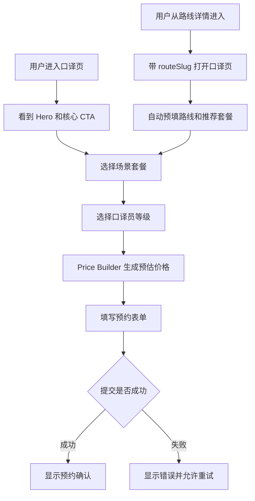

# Interpreting 口译页用户操作与交互流程

## 1. 页面定位

口译页需要从“服务介绍很丰富但偏长”的页面，重构为 **套餐化服务选择页 + 价格组合页 + 预约转化页**。

用户进入口译页后，应快速完成：

```text
选场景套餐 → 选口译员等级 → 看组合价格 → 填写预约 → 提交需求
```

页面核心不是解释所有能力，而是降低决策成本。

---

## 2. 第一屏 Hero

### 用户看到

- 清晰主张；
- 适合场景；
- 起步价格或“按套餐报价”；
- CTA：选择套餐 / 立即预约。

### 推荐文案

```text
为你的广东文化旅行配一位懂现场的口译员

从美食市集、非遗体验、商务研学到路线陪同，
选择场景套餐与口译员等级，快速获得组合报价。

CTA：
[选择口译套餐] [提交预约需求]
```

---

## 3. 第一步：选择场景套餐

### 套餐类型

建议将服务变成可选择的 Scene Packages：

- 美食市集陪同；
- 文化慢游陪同；
- 路线全程陪同；
- 商务 / 研学支持；
- 半日灵活支持；
- 节庆 / 活动现场支持。

### 套餐卡片内容

```text
文化慢游陪同
适合：古城、非遗、街区导览
时长：4 小时
基础价格：¥xxx 起
包含：行前沟通 / 现场口译 / 文化解释
CTA：选择套餐
```

### 用户操作

1. 浏览套餐卡片；
2. 点击某个套餐；
3. 被选中的套餐高亮；
4. 页面右侧 / 下方 Price Builder 同步更新基础价格。

---

## 4. 第二步：选择口译员等级

### 等级结构

- 初级：适合日常沟通、基础陪同；
- 中级：适合文化解释、路线陪同；
- 高级：适合商务、研学、复杂多语言场景。

### 等级卡片内容

```text
中级口译员
适合：文化路线 / 城市导览 / 非遗体验
语言：中文 / 英文 / 可选其他语言
经验：xx 次服务
等级加价：+¥xxx
CTA：选择等级
```

### 用户操作

1. 点击等级卡；
2. 展开该等级代表口译员；
3. 可查看口译员详情；
4. 选择具体口译员或只选择等级；
5. Price Builder 更新等级价格。

---

## 5. 第三步：组合价格 Price Builder

### 目的

让用户在预约前有明确价格预期。

### 展示内容

```text
你的口译组合

套餐：文化慢游陪同 ¥xxx
等级：中级口译员 +¥xxx
人数：2 人
时长：4 小时
路线：湛江年例文化路线（可选）

预估价格：¥xxxx
```

### 用户操作

1. 修改套餐；
2. 修改等级；
3. 修改人数；
4. 选择日期 / 时段；
5. 可选关联路线；
6. 价格实时更新。

### 重要规则

前端价格只是预估，最终价格必须由后端创建 booking 时重新计算并保存快照，防止篡改。

---

## 6. 第四步：预约表单

### 表单字段

- 姓名；
- 联系方式；
- 语言需求；
- 服务日期；
- 服务城市；
- 套餐 ID；
- 口译员等级 / profile ID；
- 人数；
- 关联 routeSlug（可选）；
- 备注。

### 用户操作

1. 填写基础信息；
2. 查看价格摘要；
3. 勾选确认；
4. 点击提交预约；
5. 成功后显示确认状态；
6. 失败时展示明确错误与重试按钮。

---

## 7. 从路线详情进入口译页

路线详情页应提供「为这条路线预约口译」入口。

### 用户路径

```text
/routes/zhanjiang-nianli
↓
点击 [为这条路线预约口译]
↓
/interpreting?route=zhanjiang-nianli
↓
口译页自动预填路线信息
```

### 预填内容

- routeSlug；
- route title；
- 推荐服务城市；
- 推荐套餐：路线陪同 / 节庆现场支持；
- 推荐等级：中级或高级。

---

## 8. FAQ 与信任模块

口译页底部保留轻量 FAQ，不要放太多长文。

### FAQ 示例

- 价格是否最终确认？
- 是否可以指定口译员？
- 是否支持商务场景？
- 如果行程变更怎么办？
- 是否可以和路线订单一起预订？

---

## 9. 完整用户路径图



---

## 10. 实现关联

### 现有文件

- `site/src/app/interpreting/page.tsx`
- `site/src/components/interpreting/MultiStepForm.tsx`
- `site/src/components/interpreting/InterpreterShowcase.tsx`
- `site/src/components/interpreting/InterpreterFlipCard.tsx`
- `site/src/lib/api-data.ts`

### 后端关联

- `api/src/modules/interpreting/*`
- booking endpoint 需要增加 package/profile/price snapshot 字段。

---

## 11. 交互重点

- 页面要比当前更短、更直接；
- 套餐和等级必须先展示，再进入表单；
- Price Builder 要始终可见或在移动端以 sticky summary 展示；
- 前端价格只能作为预估；
- 从路线详情进入时必须预填路线，减少用户重复输入。
