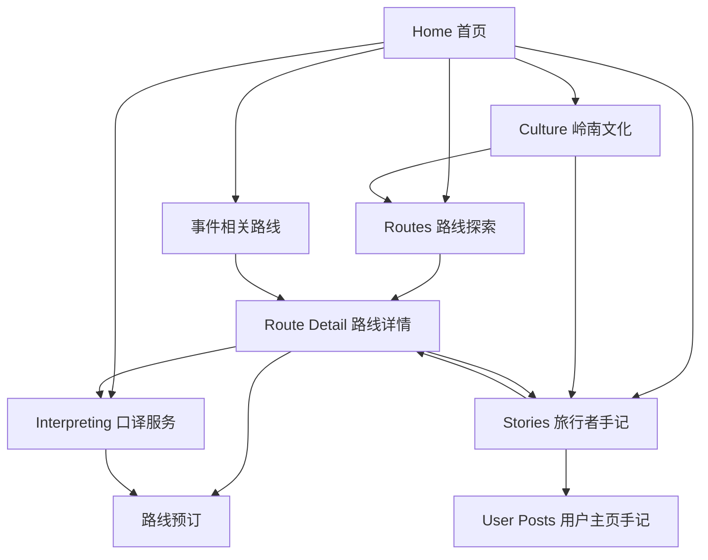

# Navigation / Tabs 全站入口与页面流转关系

## 1. 导航目标

全站导航需要从“功能罗列”转为“用户意图入口”。

用户主要意图包括：

1. 我想看看有什么路线；
2. 我想按节庆 / 活动找灵感；
3. 我想了解广东文化；
4. 我需要口译 / 陪同服务；
5. 我想看其他用户真实体验。

---

## 2. 推荐一级导航

```text
Home
Routes
Culture
Interpreting
Stories
```

中文可对应：

```text
首页
路线探索
岭南文化
口译服务
旅行者手记
```

### 命名建议

- `Routes`：强调地图探索路线；
- `Culture`：承接文化主题、节庆、地区文化；
- `Interpreting`：服务转化入口；
- `Stories` / `Traveler Notes`：比 Comment 更高级，承接 post/community。

---

## 3. 各 Tab 的核心职责

### Home

首页负责触发灵感：

- Hero；
- 近期事件路线推荐；
- 广东活动日历；
- 精选路线；
- 精选旅行者手记；
- 口译服务入口。

### Routes

路线页负责地图探索：

- 广东大地图；
- 区域小地图；
- 多路线 polyline；
- 选中路线预览；
- 进入路线详情。

### Culture

文化页负责主题种草：

- 文化主题卡片；
- 地区文化索引；
- 节庆 / 民俗活动；
- 关联路线推荐。

### Interpreting

口译页负责服务预约：

- 场景套餐；
- 口译员等级；
- 组合价格；
- booking 表单；
- 路线预填。

### Stories

旅行者手记负责社区信任：

- 全站 post；
- 用户主页 post；
- 路线相关 post/comment；
- 订单锁定发布权限。

---

## 4. 页面之间的流转关系



---

## 5. 首页到各 Tab 的入口设计

### Home → Routes

入口文案：

```text
从地图探索广东路线
[进入路线地图]
```

### Home → Culture

入口文案：

```text
按文化主题发现广东
[探索岭南文化]
```

### Home → Interpreting

入口文案：

```text
需要陪同或口译支持？
[选择口译套餐]
```

### Home → Stories

入口文案：

```text
看看旅行者如何体验这些路线
[阅读旅行者手记]
```

---

## 6. Route Detail 的交叉入口

路线详情页是最重要的转化节点，需要提供：

- 预订路线；
- 收藏路线；
- 为这条路线预约口译；
- 查看该路线旅行者手记；
- 发布 post / 评论。

### 建议 sticky CTA

桌面端：右侧或顶部 sticky summary。

移动端：底部 sticky action bar。

```text
[预订路线] [预约口译] [收藏]
```

---

## 7. Stories 与 Comment 的命名关系

用户提出“加入一个 comment 入口”，产品上建议不要把一级导航叫 Comment。

更推荐：

```text
Stories / Traveler Notes / 旅行者手记
```

原因：

1. 更符合高端独立站语气；
2. Post 和 Comment 都可以被包含进去；
3. 用户感知是“真实体验”，不是“评论区”；
4. 更适合做内容种草和 SEO。

---

## 8. 页面交互总路径

```text
Home：被事件 / 文化 / 路线吸引
↓
Routes：地图选择路线
↓
Route Detail：节点索引理解路线
↓
Stories：查看真实体验
↓
Booking / Interpreting：完成转化
```

或者：

```text
Home：看到文化主题
↓
Culture：理解主题
↓
Routes：查看相关路线
↓
Route Detail：查看节点安排
↓
Booking：预订
```

---

## 9. 导航交互重点

- 一级导航不要过多；
- Comment 应被包装为 Stories / Traveler Notes；
- Culture 不要和 Routes 割裂，必须导向路线；
- Interpreting 既可以独立进入，也可以从路线详情预填进入；
- Route Detail 是路线、口译、社区三条链路的汇合点。
