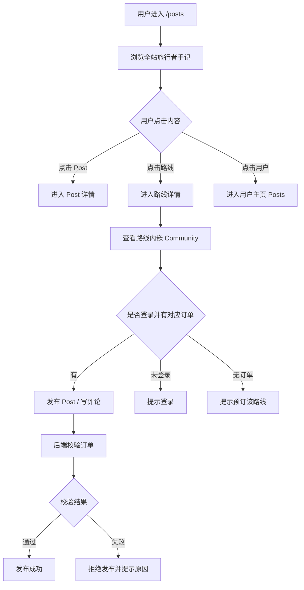

# Posts / Community 旅行者手记与评论用户操作流程

## 1. 页面定位

Posts / Community 模块用于承接用户真实体验，增强路线信任感，并形成内容反向种草。

不建议导航直接叫 Comment，因为 “Comment” 太工具化，不够高端。推荐命名：

- 旅行者手记；
- Traveler Notes；
- Stories；
- Community。

推荐路由：

```text
/posts
/users/[id]/posts
/routes/[slug]#community
```

---

## 2. 全站 `/posts` 页面

### 用户看到

```text
旅行者手记 Traveler Notes
真实路线体验、文化现场与旅行建议
```

内容列表展示：

- post 图片；
- 标题；
- 用户；
- 关联路线；
- 关联城市 / 文化标签；
- 摘录；
- 发布时间。

### 筛选维度

- 路线；
- 城市；
- 文化主题；
- 节庆活动；
- 最新 / 最热 / 推荐。

### 用户操作

1. 浏览精选 post；
2. 使用筛选器查找内容；
3. 点击 post 进入详情；
4. 点击关联路线进入路线详情；
5. 点击用户头像进入用户 post 页。

---

## 3. 路线详情页内嵌 Community

### 安置位置

建议放在路线节点内容之后、最终 CTA 附近：

```text
节点故事与安排
↓
旅行者手记 / 评论
↓
预订 CTA
↓
相似路线
```

### 用户看到

```text
旅行者手记
看看走过这条路线的人怎么说
```

展示当前路线相关：

- 精选 post；
- 用户评论；
- 评分（可选）；
- 发布入口状态。

---

## 4. 用户主页 `/users/[id]/posts`

### 用户看到

- 用户头像；
- 昵称；
- 简介；
- 已发布 post；
- 关联路线；
- 文化标签。

### 用户操作

1. 浏览某用户的所有公开 post；
2. 点击 post 查看详情；
3. 点击路线标签进入路线详情；
4. 返回 `/posts` 浏览更多用户内容。

---

## 5. 发布 Post 的权限流程

Post 与评论需要订单锁定，尤其是路线相关内容。

### 未登录用户

```text
登录后可以发布旅行手记。
[登录]
```

### 已登录但无对应路线订单

```text
预订这条路线后，你可以发布与该路线相关的手记和评论。
[预订路线]
```

### 已登录且有对应路线订单

```text
分享你的路线体验
[发布 Post] [写评论]
```

---

## 6. 订单锁定规则

### 核心规则

```text
用户预订 A 路线，只能发布 / 评论 A 路线相关内容，不能评论 B 路线。
```

### 后端判断条件

```text
canComment(routeSlug) =
用户已登录
+ 存在 routeSlug 对应订单
+ 订单状态为 paid / confirmed / completed
```

### 重要原则

前端只负责显示状态，不作为安全边界。真实权限必须由后端校验。

---

## 7. 发布 Post 表单

### 字段建议

- 标题；
- 正文；
- 图片；
- 关联 routeSlug；
- 关联 bookingId；
- 城市标签；
- 文化标签；
- 是否公开。

### 用户操作

1. 点击发布入口；
2. 系统检查是否有该路线订单；
3. 有权限则打开发布表单；
4. 用户填写内容；
5. 提交；
6. 成功后 post 出现在路线详情和个人主页；
7. 失败时显示原因。

---

## 8. 评论表单

### 评论字段

- content；
- rating（可选）；
- routeSlug；
- bookingId；
- createdAt。

### 评论状态

- 未登录：显示登录 CTA；
- 未预订：显示预订 CTA；
- 已预订：显示评论输入框；
- 已评论：可显示已评论状态，是否允许追加由产品决定。

---

## 9. 完整用户路径图



---

## 10. API 建议

- `GET /public/routes/:slug/posts`
- `GET /public/routes/:slug/comments`
- `POST /me/routes/:slug/comments`
- `POST /me/posts`
- `GET /users/:userId/posts`
- `GET /me/bookings?routeSlug=xxx`

---

## 11. 交互重点

- `/posts` 是全站内容入口；
- 路线详情页内嵌当前路线相关 post/comment；
- 用户主页展示该用户公开 post；
- 评论和发布必须与订单绑定；
- 后端校验优先于前端 UI 判断；
- 先做路线级 posts/comments，节点级评论可作为后续增强。
