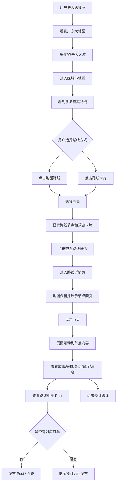

# Routes 路线页用户操作与交互流程

## 1. 页面定位

路线页不再是传统“路线卡片列表页”，而是一个 **地图探索页**。

核心用户路径是：

```text
看地图 → 选地区 → 看路线 → 高亮预览 → 进入详情 → 用节点索引浏览路线 → 看故事 / 安排 / post → 下单或收藏
```

路线页负责“地图探索和路线选择”，路线详情页负责“节点阅读和转化”，post/comment 区负责“真实用户背书”。

---

## 2. `/routes` 第一屏

### 用户看到

- 顶部 editorial hero；
- 广东大地图；
- 右侧 / 下方路线辅助卡片；
- 简短说明和 CTA。

### 推荐文案

```text
从广东地图开始选择一条故事路线
Explore Guangdong by Route
```

### 页面结构

```text
顶部导航
↓
Hero：一句主张 + 简短说明
↓
广东大地图 / 区域选择
↓
区域路线小地图
↓
路线预览卡片 / 推荐路线
```

---

## 3. 第一步：用户看广东大地图

### 地图分区

广东大地图先展示大区域，例如：

- 珠三角；
- 粤东；
- 粤西；
- 粤北；
- 潮汕文化区；
- 广府文化区；
- 客家文化区；
- 滨海 / 海岛路线区。

### 用户操作

1. 鼠标悬停某个区域；
2. 区域高亮 / 轻微放大；
3. 右侧显示区域摘要；
4. 点击区域后切换到区域小地图。

### hover 信息

例如 hover 到粤西：

```text
粤西地区
3 条路线
近期推荐：湛江年例文化路线
适合：民俗 / 海鲜 / 海岛 / 摄影
最近活动：距离某某节庆还有 12 天
```

---

## 4. 第二步：进入区域小地图

### 用户看到

点击大区域后，页面不跳转，主地图切换成区域小地图。

例如进入“粤西”：

```text
粤西小地图：湛江 / 茂名 / 阳江
```

小地图上展示真实路线 polyline：

- 湛江年例文化路线；
- 雷州文化路线；
- 滨海海鲜路线。

### 默认状态

- 未选中路线：低透明灰色线；
- 推荐路线：品牌金色 / cinnabar 轻微突出；
- 节日临近路线：显示倒计时 badge；
- 节点默认可隐藏，只在 hover / click 后出现。

---

## 5. 第三步：用户选择路线

用户可以通过两种方式选择路线。

### 方式 A：点击地图上的路线

用户点击某条 polyline 后：

- 当前路线高亮；
- 其他路线变淡；
- 地图视野聚焦到这条路线；
- 路线节点按顺序显示；
- 右侧出现路线预览卡片。

### 方式 B：点击路线卡片

路线卡片作为辅助说明，不抢地图主视觉。

卡片内容建议：

```text
湛江年例文化路线
3 天 2 晚 / 6 个节点 / 民俗节庆 / 美食 / 非遗
距离年例活动还有 12 天
```

点击卡片后，对应地图路线高亮。

---

## 6. 路线选中后的预览状态

用户选择路线后不应立即跳详情页，而是进入“预览状态”。

### 预览卡片内容

```text
湛江年例文化路线

围绕粤西年例、雷州文化、海鲜市集与村落仪式展开的故事路线。

3 天 2 晚
6 个节点
适合：文化体验 / 美食 / 摄影 / 家庭旅行

近期事件：
距离 XX 年例活动还有 12 天

CTA：
[查看路线详情] [收藏路线]
```

### 地图节点

地图上显示有序节点：

1. 赤坎老街；
2. 雷州古城；
3. 年例村落；
4. 海鲜市场；
5. 滨海酒店；
6. 返程点。

用户 hover 节点时显示节点名称和一句话介绍。

---

## 7. 第四步：进入路线详情页

用户点击「查看路线详情」进入：

```text
/routes/[slug]
```

关键原则：

> 进入详情页后，地图不能消失。地图上的节点应该成为内容索引。

---

## 8. 路线详情页结构

### 桌面端建议

```text
顶部 Hero
↓
路线概览 sticky bar
↓
左右结构：
左侧：吸顶地图 + 节点索引
右侧：节点故事 / 安排 / 景点 / 餐厅 / 酒店
↓
旅行者手记 / 评论
↓
预订 CTA / 相似路线
```

### 移动端建议

```text
顶部 Hero
↓
路线概览
↓
小地图
↓
横向节点 tabs
↓
节点内容
↓
旅行者手记 / 评论
↓
底部 sticky CTA
```

---

## 9. 节点索引交互

节点是详情页的核心导航。

```text
01 赤坎老街
02 雷州古城
03 年例村落
04 海鲜市场
05 滨海酒店
06 返程点
```

### 用户点击节点

当用户点击「03 年例村落」时：

- 地图定位到第 3 个节点；
- 第 3 个节点高亮；
- 页面滚动到对应节点内容；
- 右侧展示该节点故事、安排和相关地点。

### 用户滚动页面

用户向下滚动到某个节点内容时：

- 左侧节点索引自动高亮；
- 地图当前节点同步高亮；
- sticky overview 保持 CTA 可见。

---

## 10. 每个节点内容结构

每个节点固定为一个模块，避免信息散乱。

```text
节点 03｜年例村落

一句话简介：
这里是本路线最核心的民俗体验点。

文化故事：
介绍年例来源、村落仪式、地方饮食、宗族关系与当代生活。

今日安排：
10:00 抵达村落
11:00 参与年例仪式
12:30 村宴体验
15:00 非遗手作 / 走访
17:00 返回酒店

相关地点：
- 景点：某某祠堂 [查看介绍]
- 餐厅：某某村宴 [打开官网 / 地图]
- 酒店：某某民宿 [查看官网]
```

### 地点字段建议

- 名称；
- 类型：景点 / 餐厅 / 酒店 / 市集 / 交通；
- 地址；
- 简介；
- 图片；
- 官网链接；
- 地图定位链接。

---

## 11. Posts / Comments 安置方式

### 推荐第一期

第一期先做路线级 posts/comments，不做节点级评论。

在路线详情页节点内容之后放：

```text
旅行者手记
看看走过这条路线的人怎么说
```

展示当前路线相关 post/comment。

### 后续增强

后期可以支持节点级评论，例如“年例村落节点评论”。

---

## 12. 订单锁定评论交互

### 未登录用户

```text
登录后可查看完整旅行者手记与评论。
[登录]
```

### 已登录但未预订该路线

```text
预订这条路线后，你可以发布旅行手记和评论。
[预订路线]
```

### 已预订该路线

```text
分享你的湛江路线体验。
[发布 Post] [写评论]
```

### 权限规则

```text
用户是否可以评论某路线 =
用户已登录
+ 用户存在该路线有效订单
+ 订单状态为 paid / confirmed / completed
```

真实权限必须由后端校验：用户预订湛江路线，只能评论湛江路线，不能评论其他路线。

---

## 13. 完整用户路径图



---

## 14. 实现关联

### 现有可复用文件

- `site/src/app/routes/page.tsx`
- `site/src/app/routes/[slug]/RouteDetailClient.tsx`
- `site/src/lib/map-projection.ts`
- `site/src/data/routes.ts`
- `site/src/components/routes/ScrollStoryRoute.tsx`
- `site/src/components/routes/IntroHero.tsx`

### 建议新增组件

路线页：

- `RouteExplorerMap.tsx`
- `RegionMiniMapGrid.tsx`
- `RouteMapCardRail.tsx`

路线详情页：

- `RoutePolylineMap.tsx`
- `RouteNodeIndex.tsx`
- `RouteNodeArrangement.tsx`
- `RouteCommunitySection.tsx`

---

## 15. 交互重点

- 地图不要做成复杂工具地图，要做成高端视觉探索地图；
- 路线卡片是辅助，不要抢地图风头；
- 用户选择路线后先预览，不要立即跳转；
- 详情页要保留地图，并用节点作为索引；
- post/comment 放在节点内容之后，用作信任增强；
- 移动端要降低地图复杂度，改为小地图 + 横向节点 tabs。
