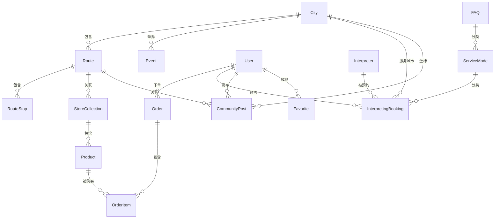

# 凌云游 (LingTour) 管理后台 —— 调研与设计文档

> 基于对 `site/` 前端代码的全面分析，梳理出需要管理后台覆盖的全部数据实体、字段结构及管理需求。

---

## 一、项目业务画像

凌云游是一个面向**国际旅客**（以英语为主）的**广东深度人文旅游平台**，核心提供四种服务：

| 业务板块 | 描述 | C端路由 |
|---------|------|---------|
| 城市文化 | 深度解读广东城市的人文、美食、地质、历史 | `/culture/:slug` |
| 故事路线 | 围绕单一主题打造的半日/全天旅游路线 | `/routes/:slug` |
| 口译陪同 | 按小时/半天/全天预约的英语本地陪同 | `/interpreting` |
| 文创商城 | 与路线绑定的手工艺品、特产商城 | `/shop` |

辅助功能：社区帖子 (`/community`)、用户账户 (`/login`)、结算 (`/checkout`)、首页活动日历。

---

## 二、后台模块全面设计

### 模块总览（15 个模块）

```
凌云游管理后台
├── 1. 仪表盘 Dashboard
├── 2. 城市管理 Cities
├── 3. 路线管理 Routes（含站点管理）
├── 4. 商城系列管理 Store Collections
├── 5. 商品管理 Products
├── 6. 口译服务模式管理 Service Modes
├── 7. 口译员管理 Interpreters
├── 8. 口译预约管理 Interpreting Bookings
├── 9. 常见问题管理 FAQs
├── 10. 活动/节庆管理 Events
├── 11. 订单管理 Orders
├── 12. 用户管理 Users
├── 13. 社区帖子管理 Community Posts
├── 14. 首页内容管理 Home Page
├── 15. 系统设置 Settings
```

---

### 2.1 仪表盘 (Dashboard)

**目的**：运营人员登录后看到的第一屏核心数据。

**统计卡片**：
- 注册用户总数
- 城市覆盖数
- 已发布路线数
- 商城商品总数
- 口译员入驻数
- 待处理预订数（口译）
- 待处理订单数（商城）
- 近7日新增用户趋势

**图表**：
- 近30天订单金额趋势图
- 口译预约按服务模式分布（小时/半天/全天）
- 热门城市 Top5（按路线关联数）

---

### 2.2 城市管理 (Cities)

**数据来源**：`/public/cities` API，类型 `ApiCity` + `CityCulture`

**字段清单**（来自 `api-data.ts` 中的 `ApiCity` 和 `data/culture.ts` 中的 `CityCulture`）：

| 字段 | 类型 | 说明 | 管理操作 |
|------|------|------|----------|
| `id` | string (UUID) | 主键 | 不可编辑 |
| `slug` | string | URL 标识（如 "zhanjiang"） | 新增时必填 |
| `name` | string | 城市名（中/英） | 编辑 |
| `regionLabel` | string | 地区标签（如 "Southern coast"） | 编辑 |
| `adcode` | number | 行政区划代码 | 编辑 |
| `heroImage` | string (URL) | 头图 | 图片上传 |
| `heroNarrative` | string | 头图叙述文案 | 富文本编辑 |
| `tags` | string[] | 标签（如 ["Coast", "Seafood"]） | 标签管理 |
| `editorIntro` | string | 编辑推荐语/摘要 | 编辑 |
| `galleryImages` | string[] | 图片集 | 图片批量上传 |
| `foodTitle` | string | 美食标题 | 编辑 |
| `foodDescription` | string | 美食描述 | 富文本 |
| `foodImages` | string[] | 美食图片集 | 图片上传 |
| `sections` | Section[] | 长文章段落 | 动态添加编辑 |
| `stats` | string[] | 城市数据亮点 | 编辑 |
| `quotes` | string[] | 引语/金句 | 编辑 |
| `breathImages` | string[] | 段落间呼吸图片 | 图片上传 |
| `routes` | 关联 | 关联的路线 | 多选关联 |

**Section 子结构**：
```typescript
{
  id: string;
  title: string;        // 段落标题
  body: string;         // 段落正文（富文本）
  image: string;        // 配图
  statLabel: string;    // 数据标签
  statValue: string;    // 数据值
  breathImage: string;  // 呼吸图
  breathQuote: string;  // 呼吸引语
  sortOrder: number;    // 排序
}
```

**列表展示字段**：缩略图、城市名、标签、关联路线数、状态
**操作**：新增、编辑、删除（软删/下架）、预览（跳转C端页面）

---

### 2.3 路线管理 (Routes)

**数据来源**：`/public/routes` API，类型 `ApiStoryRoute` + `StoryRoute`

**字段清单**：

| 字段 | 类型 | 说明 |
|------|------|------|
| `id` | string | 主键 |
| `slug` | string | URL 标识 |
| `title` | string | 路线标题（中/英） |
| `cultureTag` | enum | 文化标签：Guangfu / Chaoshan / Hakka / Coastal / Bay Area / Mountain |
| `cityName` | string | 所属城市 |
| `duration` | string | 时长（如 "1 day"） |
| `audience` | string | 目标人群 |
| `summary` | string | 摘要 |
| `story` | string | 路线总述 |
| `coverImage` | string | 封面图 |
| `stops` | RouteStop[] | 站点列表（核心子表） |
| `routeCityLinks` | CityLink[] | 关联其他城市 |
| `status` | enum | 发布状态：draft / published / archived |
| `price` | number | 路线价格（如适合有价路线） |

**RouteStop 子结构**（这是后台最复杂的嵌套编辑）：
```typescript
{
  id: string;
  sortOrder: number;      // 站点顺序
  time: string;           // 时间（如 "08:00"）
  stopName: string;       // 站点名称
  plan: string;           // 计划简述
  story: string;          // 站点故事
  culturalStory: string;  // 文化深度解读（富文本）
  details: string[];      // 体验要点列表
  image: string;          // 配图
  lat: number;            // 纬度
  lng: number;            // 经度
  meal: string;           // 餐食安排
  hotel: string;          // 住宿安排
  transit: string;        // 交通方式
  placeDetail: string;    // 地点详述
}
```

**管理特性**：
- 站点的拖拽排序
- 站点内联编辑（弹窗或展开行）
- 路线预览（模拟C端滚动叙事效果）
- 上下架控制

---

### 2.4 商城系列管理 (Store Collections)

**数据来源**：`/public/shop/collections` API

| 字段 | 类型 | 说明 |
|------|------|------|
| `id` | string | 主键 |
| `slug` | string | URL 标识 |
| `title` | string | 系列名称（如 "Coastal Life Kit"） |
| `routeName` | string | 关联路线名 |
| `routeSlug` | string | 关联路线slug |
| `image` | string | 封面图 |
| `body` | string | 系列描述 |
| `productCount` | number | 包含商品数 |

**操作**：新增/编辑系列、查看该系列下商品

---

### 2.5 商品管理 (Products)

**数据来源**：`/public/shop/products` API，类型 `ApiStoreProduct` + `StoreProduct`

| 字段 | 类型 | 说明 |
|------|------|------|
| `id` | string | 主键 |
| `slug` | string | URL 标识 |
| `name` | string | 商品名称 |
| `collectionId` | string | 所属系列 |
| `price` | number | 价格（如 SGD 32） |
| `currency` | string | 币种 |
| `tag` | string | 标签（如 "Handcrafted"） |
| `image` | string | 主图 |
| `story` | string | 商品故事 |
| `material` | string | 材质 |
| `dimensions` | string | 尺寸 |
| `origin` | string | 产地 |
| `care` | string | 保养说明 |
| `gallery` | string[] | 详情图集 |
| `stock` | number | 库存 |
| `originTrace` | object | 产地溯源（见下方） |
| `status` | enum | on_sale / off_shelf |

**originTrace 产地溯源子结构**（C端展示特色）：
```typescript
{
  location: string;       // 产地位置
  citySlug: string;       // 城市slug
  cityName: string;       // 城市名
  materialSource: string; // 原料来源描述
  craftTradition: string; // 工艺传统描述
  process: string;        // 制作过程描述
  mapAdcode: number;      // 地图区域代码
}
```

**列表展示**：缩略图、商品名、系列、价格、库存、状态
**操作**：新增/编辑（含产地溯源）、上下架、库存调整

---

### 2.6 口译服务模式管理 (Service Modes)

**数据来源**：`/public/interpreting` API → `service_modes`

| 字段 | 类型 | 说明 |
|------|------|------|
| `id` | string | 主键 |
| `sortOrder` | number | 排序 |
| `title` | string | 模式名称（如 "Hourly Companion"） |
| `price` | string | 价格显示（如 "$180 / hr"） |
| `bestFor` | string | 最适合场景 |
| `body` | string | 描述文案 |
| `includes` | string[] | 包含服务列表 |
| `accent` | enum | 卡片色调：light / dark |
| `featured` | boolean | 是否标记为推荐 |

**操作**：排序调整、编辑文案/价格、新增模式

---

### 2.7 口译员管理 (Interpreters)

**数据来源**：`/public/interpreting` API → `profiles`

| 字段 | 类型 | 说明 |
|------|------|------|
| `id` | string | 主键 |
| `sortOrder` | number | 排序 |
| `name` | string | 口译员名称/类型 |
| `language` | string | 服务语种（如 "English & Cantonese/Mandarin"） |
| `focus` | string | 专注领域 |
| `helps` | string[] | 能力标签 |
| `avatar` | string | 头像 |
| `bio` | string | 个人简介 |
| `status` | enum | active / inactive / pending_review |
| `city` | string | 服务城市 |

**操作**：新增/编辑、审核状态变更（待审→激活）、禁用

---

### 2.8 口译预约管理 (Interpreting Bookings)

**数据来源**：C端 `MultiStepForm` 提交数据（目前前端直接展示"已收到请求"，需后端接收存储）

| 字段 | 类型 | 说明 |
|------|------|------|
| `id` | string | 主键 |
| `name` | string | 预约人姓名 |
| `contact` | string | 联系方式（Email/WhatsApp） |
| `city` | string | 服务城市 |
| `date` | string | 服务日期 |
| `mode` | string | 服务模式 |
| `groupSize` | string | 团体人数 |
| `needs` | string | 需求描述 |
| `fastTrack` | boolean | 是否快速通道 |
| `status` | enum | pending / confirmed / completed / cancelled |
| `assignedInterpreterId` | string | 分配的口译员 |
| `createdAt` | datetime | 创建时间 |

**操作**：查看列表、确认预约、分配口译员、完成/取消

---

### 2.9 常见问题管理 (FAQs)

**数据来源**：`/public/interpreting` API → `faqs`

| 字段 | 类型 | 说明 |
|------|------|------|
| `id` | string | 主键 |
| `sortOrder` | number | 排序 |
| `question` | string | 问题 |
| `answer` | string | 答案 |
| `category` | string | 分类（interpreting / general / routes） |

**操作**：新增/编辑/删除、拖拽排序

---

### 2.10 活动/节庆管理 (Events)

**数据来源**：`data/mock/events.ts` + `HomeEventCarousel` 组件

| 字段 | 类型 | 说明 |
|------|------|------|
| `id` | string | 主键 |
| `title` | string | 活动名称 |
| `date` | string (YYYY-MM-DD) | 活动日期 |
| `endDate` | string | 结束日期（多日活动） |
| `city` | string | 所在城市 |
| `citySlug` | string | 城市slug |
| `adcode` | number | 行政区划 |
| `tags` | string[] | 标签 |
| `summary` | string | 摘要 |
| `description` | string | 详细描述（富文本） |
| `relatedRouteSlugs` | string[] | 关联路线 |
| `image` | string | 封面图 |
| `status` | enum | upcoming / ongoing / past / draft |

**操作**：新增/编辑、活动日历视图

---

### 2.11 订单管理 (Orders)

**数据来源**：`CheckoutClient` 组件（商城结算）

**商城订单字段**：

| 字段 | 类型 | 说明 |
|------|------|------|
| `id` | string | 订单号 |
| `userId` | string | 用户ID |
| `items` | OrderItem[] | 商品明细 |
| `subtotal` | number | 小计 |
| `shipping` | number | 运费 |
| `tax` | number | 税费 |
| `total` | number | 合计 |
| `currency` | string | 币种 |
| `shippingAddress` | object | 收货地址 |
| `contactEmail` | string | 联系邮箱 |
| `status` | enum | pending / paid / shipped / delivered / refunded / cancelled |
| `paymentMethod` | string | 支付方式 |
| `createdAt` | datetime | 下单时间 |

**OrderItem 子结构**：
```typescript
{
  productId: string;
  productName: string;
  quantity: number;
  unitPrice: number;
}
```

**操作**：查看列表、筛选（状态/时间）、查看详情、改状态（发货/退款）

---

### 2.12 用户管理 (Users)

**数据来源**：`account` 翻译模块（有登录/注册流程）

| 字段 | 类型 | 说明 |
|------|------|------|
| `id` | string | 用户ID |
| `name` | string | 姓名 |
| `email` | string | 邮箱 |
| `avatar` | string | 头像 |
| `locale` | enum | 语言偏好：en / zh |
| `createdAt` | datetime | 注册时间 |
| `status` | enum | active / banned / inactive |
| `bookingsCount` | number | 预约次数 |
| `ordersCount` | number | 订单次数 |
| `favorites` | string[] | 收藏的路线/商品/城市 |

**操作**：查看列表、查看详情、拉黑/解封

---

### 2.13 社区帖子管理 (Community Posts)

**数据来源**：`data/mock/community-posts.ts` + `/community` 页面

| 字段 | 类型 | 说明 |
|------|------|------|
| `id` | string | 帖子ID |
| `userName` | string | 用户名 |
| `userHandle` | string | 用户handle |
| `userAvatar` | string | 头像 |
| `image` | string | 帖子图片 |
| `title` | string | 标题 |
| `excerpt` | string | 摘要 |
| `content` | string | 正文（富文本） |
| `location` | string | 地点 |
| `route` | string | 关联路线 |
| `date` | string | 发布日期 |
| `channel` | enum | 频道：Field Notes / Food Map / Hidden Stop / Culture Desk |
| `mood` | string | 心情标签 |
| `tags` | string[] | 标签 |
| `likes` | number | 点赞数 |
| `comments` | number | 评论数 |
| `saves` | number | 收藏数 |
| `status` | enum | published / pending_review / hidden |

**操作**：审核帖子、精选/推荐、隐藏/删除

---

### 2.14 首页内容管理 (Home Page)

**数据来源**：`data/home.ts` + `fetchHomeData()`

可管理的首页区块：

| 区块 | 字段 | 说明 |
|------|------|------|
| Hero统计 | `homeHeroStats[]` | 首页4个统计卡片（标题+描述） |
| 信任指标 | `trustMetrics[]` | 数字指标（value + label） |
| 入口卡片 | `homeEntryCards[]` | 4个业务入口卡片 |
| 精选路线 | `featuredRoutes[]` | 首页精选展示的路线 |
| 文化亮点 | `cultureHighlights[]` | 首页文化板块推荐 |
| 评价展示 | `testimonials[]` | 首页用户评价/引言 |

**操作**：
- 选择哪些路线/城市出现在首页
- 编辑首页文案（hero stats、trust metrics等）
- 管理评价展示内容

---

### 2.15 系统设置 (Settings)

| 设置项 | 说明 |
|--------|------|
| 网站标题/描述 | SEO相关 |
| 支持语种 |当前 en / zh |
| 币种设置 | 默认 SGD |
| 税率设置 | 当前 7.6% |
| 运费模板 | 按国家/地区 |
| 口译服务城市 | 可选城市列表 |
| 口译服务模式 | 快速通道设置 |

---

## 三、数据实体关系图



## 四、后端 API 需求总结

基于以上分析，管理后台需要的 API 端点：

| 模块 | 端点前缀 | CRUD | 说明 |
|------|---------|------|------|
| 认证 | `/admin/auth` | Login/Logout | 管理员登录 |
| 城市 | `/admin/cities` | 全CRUD | 含 section 嵌套 |
| 路线 | `/admin/routes` | 全CRUD | 含 stop 嵌套 |
| 商城系列 | `/admin/shop/collections` | 全CRUD | |
| 商品 | `/admin/shop/products` | 全CRUD | 含 originTrace |
| 口译模式 | `/admin/interpreting/modes` | 全CRUD | |
| 口译员 | `/admin/interpreting/profiles` | 全CRUD | |
| 口译预约 | `/admin/interpreting/bookings` | R+U | 查看+状态更新 |
| FAQ | `/admin/interpreting/faqs` | 全CRUD | |
| 活动 | `/admin/events` | 全CRUD | |
| 订单 | `/admin/orders` | R+U | 查看+状态更新 |
| 用户 | `/admin/users` | R+U | 查看+状态干预 |
| 帖子 | `/admin/community/posts` | R+U+D | 审核+管理 |
| 首页 | `/admin/home` | R+U | 首页内容配置 |
| 仪表盘 | `/admin/dashboard` | R | 统计数据 |
| 设置 | `/admin/settings` | R+U | 系统配置 |
| 上传 | `/admin/upload` | C | 图片/文件上传 |

## 五、后台页面结构设计

```
/admin
├── /login                          登录页
├── /dashboard                      仪表盘
├── /cities                         城市列表
│   ├── /cities/create              新增城市
│   └── /cities/:id/edit            编辑城市（含 sections 管理）
├── /routes                         路线列表
│   ├── /routes/create              新增路线
│   └── /routes/:id/edit            编辑路线（含 stops 管理）
├── /shop
│   ├── /shop/collections           系列列表
│   ├── /shop/collections/create    新增系列
│   ├── /shop/collections/:id/edit  编辑系列
│   ├── /shop/products              商品列表
│   ├── /shop/products/create       新增商品
│   └── /shop/products/:id/edit     编辑商品
├── /interpreting
│   ├── /interpreting/modes         服务模式列表
│   ├── /interpreting/profiles      口译员列表
│   ├── /interpreting/bookings      预约管理
│   └── /interpreting/faqs          FAQ管理
├── /orders                         订单列表
│   └── /orders/:id                 订单详情
├── /users                          用户列表
│   └── /users/:id                  用户详情
├── /community                      帖子列表
│   └── /community/:id              帖子详情
├── /events                         活动列表
├── /home                           首页配置
└── /settings                       系统设置
```

## 六、关键技术实现要点

### 6.1 嵌套编辑
路线中的 **stops** 和城市中的 **sections** 是核心难点，建议：
- 路线 stops：使用 `el-table` + 行内展开或抽屉 (Drawer) 编辑单个 stop
- 城市 sections：使用动态表单数组 + 拖拽排序（`vuedraggable`）

### 6.2 双语内容
城市、路线、商品等均有中英双语版本，管理后台需支持：
- Tab 切换中/英文编辑
- 或者同时展示中英文字段
- 图片无需双语（共用）

### 6.3 图片管理
多个字段涉及图片/图片数组（heroImage, gallery, foodImages, breathImages 等）：
- 统一使用图片上传组件（Element Plus Upload）
- 支持多图上传（gallery 类字段）
- 图片预览

### 6.4 富文本编辑
`heroNarrative`、`story`、`culturalStory`、`body` 等字段需富文本：
- 推荐轻量方案：Tiptap 或 Quill
- MVP阶段可先用 textarea（Markdown 格式）

### 6.5 状态管理
多模块涉及状态流转：
- 路线：draft → published → archived
- 商品：on_sale ↔ off_shelf
- 口译员：pending_review → active ↔ inactive
- 预约：pending → confirmed → completed / cancelled
- 订单：pending → paid → shipped → delivered / refunded
- 用户：active ↔ banned
- 帖子：pending_review → published / hidden

---

## 七、与原计划对比

| 对比项 | 原计划 | 调研后设计 |
|--------|--------|-----------|
| 模块数 | 7 | 15 |
| 城市管理 | 基本CRUD | 含 sections/food/gallery 等嵌套 |
| 路线管理 | 基本CRUD | 含 stops 多维嵌套编辑 |
| 商城 | 合并"商城管理" | 拆为 系列管理 + 商品管理 |
| 口译 | 基本"翻译人员" | 拆为 模式/口译员/预约/FAQ 四模块 |
| 订单 | 三合一 | 明确区分 商城订单 + 口译预约 |
| 活动 | ❌ 遗漏 | ✅ 新增（首页有活动日历） |
| 社区 | ❌ 遗漏 | ✅ 新增（有完整的社区帖子系统） |
| 首页 | ❌ 遗漏 | ✅ 新增（首页内容可配置） |
| 设置 | ❌ 遗漏 | ✅ 新增（系统参数管理） |
| API 设计 | 仅提"联调后端" | 明确 16 组 API 端点 |
| 页面结构 | 未设计 | 完整路由树 |
